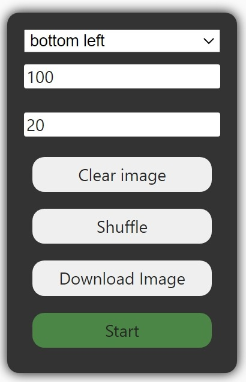

# Facebook Image Loader

## Features
- Automatically scroll down and load images.
- Display loaded images in focus view.
- Keyboard navigation support.
- Download image in one click.

## Installation
1. Install [Tampermonkey](https://www.tampermonkey.net/) to your browser.
2. Download the `main.js` script.
3. Go to the utilites tab in Tampermonkey's dashboard.
4. Import the `main.js` from file.
5. Click `Install`.

## Usage

- First row is for change panel position.
- Second row is for setting image size filter, all images which width value in pixel below this will be ignored.
- Third row is to set the minimum numbers of image should be loaded. Page will automatically scroll down and load images until the number of images reached the minimum value.
- **Load image:** Start loading image, also can be triggered by pressing enter when `Images count` input is focused.
- **Shuffle:** Randomly shuffle the loaded images.
- **Download image:** Download the image currently shown.
- **Start:** Start the focus view mode. In the focus view mode, all the original content will be blurred, and image will be displayed in the center of the screen with appropriate size. Navigate to the next/previous image by pressing left or right arrow. Press escape or click `stop` to exit the focus view mode.

## How does it work?
Using the `querySelectorAll` function to choose all loaded images in each posts, and filtered by 2 filter function and store the results in an array.
```
Array.from(document.querySelectorAll('div[role="article"] img'))
  .filter(x => !x.className.includes('j1lvzwm4'))
  .filter(x => x.width > filterSize)
  .forEach((x, i) => Images[i] = x);
```  
Focus view is a fullscreen div with `backdrop-filter: blur()` and containing a canvas. The image then be drawn on to canvas, and the canvas is adjusted its size to fit the screen.
```
const fraction = Math.min(window.innerWidth / image.width, window.innerHeight / image.height) * 0.9;
imgsrc = image.src;
const canvas = document.createElement('canvas');
canvas.width = image.width;
canvas.height = image.height;
canvas.style.cssText = `
  zoom: ${fraction};
  box-shadow: 0 0 10px black;
`;

const ctx = canvas.getContext('2d');
ctx.drawImage(image,0,0,image.width,image.height);
```
Canvas cannot directly interpret into dataURL or Blob due to taint. Thus, we using `fetch` api to get the image's Blob data, and create an ObjectURL to download it.
```
const blob = await fetch(image.src).then(res => res.blob()).then(blob => blob);
const url = URL.createObjectURL(blob);
downloadLink.href = url;
downloadLink.click();
```

## Future work
- Batch images download.
- Support Instagram.
